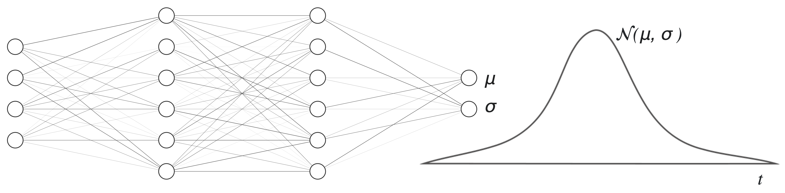

# Probabilistic prediction of traveling times

We will use a neural network to predict the travelling time distribution between two locations. To predict a distribution instead of a single value we modify the neural network by:

- feeding its outputs to the parameters of a probability distribution function (LogNormal oder Normal). Optimizing the
  model against the observed data is equivalent to minimizing the corresponding negative log-likelihood of the joint-pdf
  predicted by the model.
  

- adding an extra layer with monotonically increasing outputs that represent a fixed set of the distribution-quantiles.
  Optimizing the model against the observed data is equivalent to minimizing the average of the pinball losses for every
  quantile.

We apply both models to the NYC taxi trip data that can be found as a [BigQuery public dataset](https://cloud.google.com/datasets) hosted by Google. Recently, the exact pickup/drop-off locations were replaced location-ids. The model supports both options depending on what data do you have.
