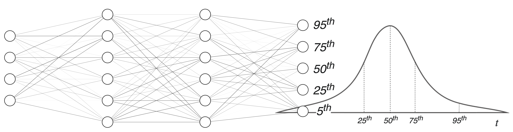
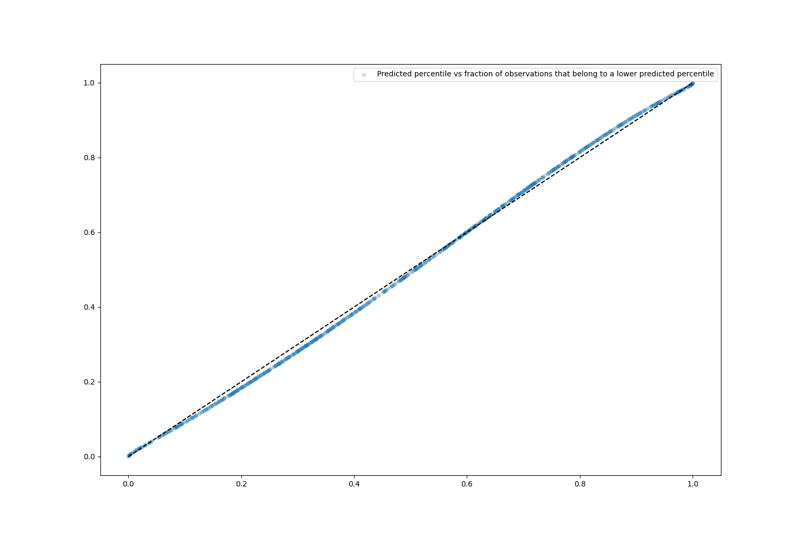
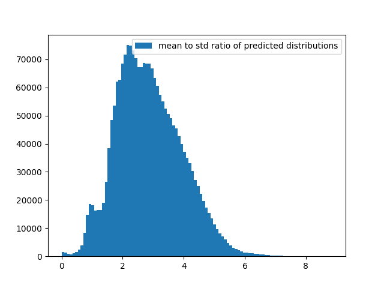

# Probabilistic prediction of travel times

We will use a neural network to predict the travel time distribution between two locations. To predict a
distribution instead of a single value we modify the neural network by:

- feeding its outputs to the parameters of a probability distribution function (LogNormal oder Normal). Optimizing the
  model against the observed data is equivalent to minimizing the corresponding negative log-likelihood of the joint-pdf
  predicted by the model.

  <br><br><br><br>

- adding an extra layer with monotonically increasing outputs that represent a fixed set of the distribution-quantiles.
  Optimizing the model against the observed data is equivalent to minimizing the average of the pinball losses for every
  quantile.

  <br><br><br><br>

We apply both models to the NYC taxi trip data that can be found
in the [nyc.gov](https://www1.nyc.gov/site/tlc/about/tlc-trip-record-data.page) website.

## Docker image and environment variables

- Build the image:
  ```shell
  docker build -t travel_time -f Dockerfile .
  ```

- The environment variables that will be used in the model are in `src/settings.py`. Change them:
  ```shell
  export DATA_DIR=data
  export TFBOARD_DIR=tfboard
  export ARTIFACTS_DIR=artifacts
  
  # maximum memory in GB that can be allocated by tensorflow
  export GPU_MEMORY_LIMIT=16
  ```

## Collect & preprocess data

- We can collect the NYC taxi trip data (drives and taxi zones) for the entire 2016
  from [nyc.gov](https://www1.nyc.gov/site/tlc/about/tlc-trip-record-data.page) website, and store it in `DATA_DIR`:
  ```shell
  docker run -it --rm --runtime=nvidia --gpus all --name=experiment \
    -v $DATA_DIR:/tf/data \
    -v $TFBOARD_DIR:/tf/tfboard \
    -v $ARTIFACTS_DIR:/tf/artifacts \
    --env GPU_MEMORY_LIMIT=$GPU_MEMORY_LIMIT \
    travel_time:latest python src/main.py collect-data --year=2016
  ```

- To generate features from the data and split it into a training, validation and test datasets execute:
  ```shell
  docker run -it --rm --runtime=nvidia --gpus all --name=experiment \
    -v $DATA_DIR:/tf/data \
    -v $TFBOARD_DIR:/tf/tfboard \
    -v $ARTIFACTS_DIR:/tf/artifacts \
    --env GPU_MEMORY_LIMIT=$GPU_MEMORY_LIMIT \
    travel_time:latest python src/main.py preprocess-data \
    --tr=0.8 --va=0.1 --te=0.1
  ```
  It splits the data from every month into a training, validation and test dataset and stores it in a separate folder,
  as shown below:

  ```shell
  $DATA_DIR
  ├── raw/             # obtained in the data collection step
  └── preprocessed/    # obtained in the data preprocessing step
      ├── train/
      ├── validation/
      └── test/
  ```
  If you are worried about data drift over time you might need a different type of data splitting.

## Train model

- The json strings that you can provide overwrite the default arguments used by the model:
  ```shell
  docker run -it --rm --runtime=nvidia --gpus all --name=experiment \
    -v $DATA_DIR:/tf/data \
    -v $TFBOARD_DIR:/tf/tfboard \
    -v $ARTIFACTS_DIR:/tf/artifacts \
    --env GPU_MEMORY_LIMIT=$GPU_MEMORY_LIMIT \
    travel_time:latest python src/main.py train \
    --model_wrapper=ModelPDF \
    --model_args='{"l2": 0.0001, "batch_normalization": false, "layer_sizes": [64, [64, 64], [64, 64], 32, 8]}' \
    --ds_args='{"max_files": 2}' \
    --callbacks_args='{"period": 10, "profile_batch": 0}' \
    --training_args='{"epochs": 40}'
  ```

- After training the model the following directory structure will be generated (the experiment id is generated
  automatically):
  ```shell
  $ARTIFACTS_DIR
  └── ex_<id>
      ├── checkpoints/
      ├── model/
      └── model_attributes.json

  $TFBOARD_DIR
  └── ex_<id>
      ├── train/
      └── validation/
  ```

## Evaluate model

- We can evaluate accuracy and the uncertainty estimation provided by the predicted probability distribution functions
  or quantiles by using the following metrics/plots:

    - Fraction of cases (y-axis) where the observed percentile is below a given value (x-axis). Under observed
      percentile we understand the percentile of the predicted distribution to which the observation belongs to. For
      example, if we have predicted a normally distributed pdf with zero mean and unit standard deviation, and the
      observed value is 0, then the observed percentile will be 50. In the ideal case the plot should follow a straight
      line from (x,y) = (0,0) to (100,1).
      <br><br>

    - Histograms of the ratios between the mean and the standard deviation of the predicted distribution for every
      datapoint. For the model that predicts a fixed number of percentiles we replace the standard deviation with the
      difference between two percentiles, for example the 15-th and 85-th. This makes it harder to compare the
      predictions of both models.
      <br><br>
      
      

## Serve model (WIP)

- Variables to set:
  ```shell
  ARTIFACTS_DIR= < settings.ARTIFACTS_DIR >
  EXPERIMENT=ex_010
  MODEL_DIR=${ARTIFACTS_DIR}/${EXPERIMENT}
  ```

- Model that predicts parameters of a probability distribution function:
    - Since the output of the model is a random variable we make it deterministic by:
        - cutting the last layer
        - eventually adding a deterministic layer that calculates the mean and standard deviation of the distribution

      To create this modified model we run:
      ```shell
      PYTHONPATH=$(pwd) python src/main.py prepare-servable \
        --load_dir=${MODEL_DIR}
      ```

    - Start TensorFlow Serving container and make a sample request:
      ```shell
      docker run -t --rm -p 8501:8501 \
          --name=serving \
          -v "$MODEL_DIR/model_mean_std:/models/model_mean_std/1" \
          -e MODEL_NAME=model_mean_std \
          tensorflow/serving
  
      # Does not work for the model with Lognormal dist
      curl -X POST http://localhost:8501/v1/models/model_mean_std:predict \
            -H 'Content-type: application/json' \
            -d '{"signature_name": "serving_default", "instances": [{"dropoff_area": [7.9e-05], "dropoff_lat": [40.723752], "dropoff_lon": [-73.976968], "month": [1], "passenger_count": [1], "pickup_area": [0.000422], "pickup_lat": [40.744235], "pickup_lon": [-73.906306], "time": [800], "trip_distance": [2.3], "vendor_id": [0], "weekday": [3]}]}'
      
      docker container stop serving
      ```

- Quantile model (not tested)


- Useful commands to check the model signature:
  ```shell
  # output 1,2: `serve`
  saved_model_cli show --dir ${ARTIFACTS_DIR}/${EXPERIMENT}/model
  saved_model_cli show --dir ${ARTIFACTS_DIR}/${EXPERIMENT}/model_mean_std
  
  # output 1: `__saved_model_init_op`
  # output 2: `__saved_model_init_op`, `serving_default`
  saved_model_cli show --dir ${ARTIFACTS_DIR}/${EXPERIMENT}/model --tag_set serve
  saved_model_cli show --dir ${ARTIFACTS_DIR}/${EXPERIMENT}/model_mean_std --tag_set serve
  
  saved_model_cli show --dir ${ARTIFACTS_DIR}/${EXPERIMENT}/model_mean_std \
    --tag_set serve --signature_def serving_default
  ```
