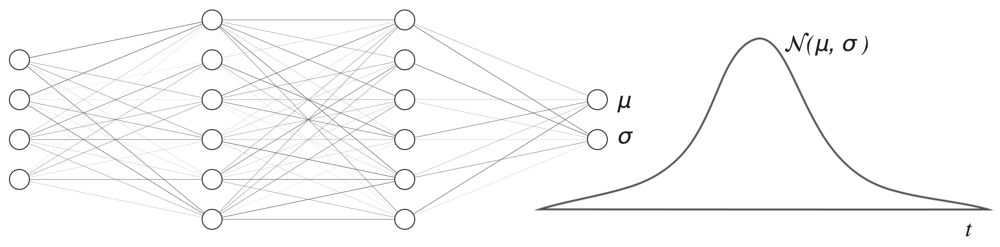
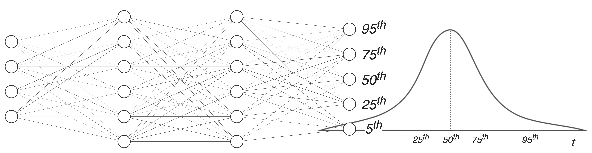
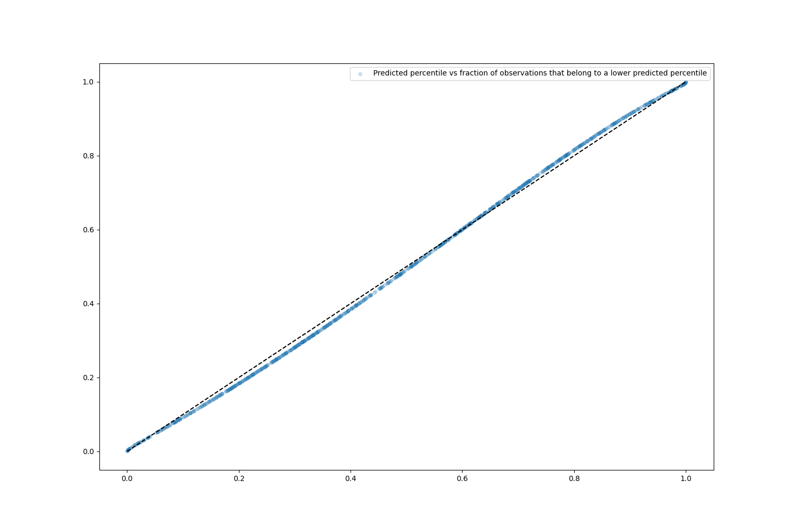
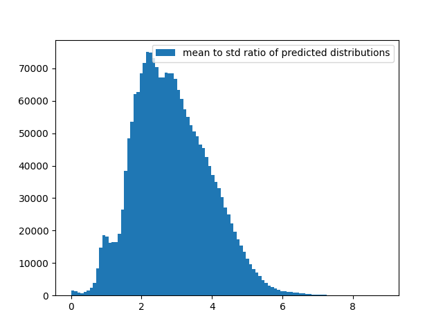

# Probabilistic prediction of travel times

We will use a neural network to predict the travel time distribution between two locations. To predict a
distribution instead of a single value we modify the neural network by:

- feeding its outputs to the parameters of a probability distribution function (LogNormal oder Normal). Optimizing the
  model against the observed data is equivalent to minimizing the corresponding negative log-likelihood of the joint-pdf
  predicted by the model.

  <br><br><br><br>

- adding an extra layer with monotonically increasing outputs that represent a fixed set of the distribution-quantiles.
  Optimizing the model against the observed data is equivalent to minimizing the average of the pinball losses for every
  quantile.

  <br><br><br><br>

We apply both models to the NYC taxi trip data that can be found
in the [nyc.gov](https://www1.nyc.gov/site/tlc/about/tlc-trip-record-data.page) website.

## Docker image and environment variables

- Build the image:
  ```shell
  docker build -t travel_time -f Dockerfile .
  ```

- The environment variables that will be used in the model are in `src/settings.py`. Change them:
  ```shell
  export DATA_DIR="$(pwd)"/data
  export TFBOARD_DIR="$(pwd)"/tfboard
  export ARTIFACTS_DIR="$(pwd)"/artifacts
  
  # maximum memory in GB that can be allocated by tensorflow
  export GPU_MEMORY_LIMIT=16
  ```

## Collect & preprocess data

- We can collect the NYC taxi trip data (drives and taxi zones) for the entire 2016
  from [nyc.gov](https://www1.nyc.gov/site/tlc/about/tlc-trip-record-data.page) website, and store it in `DATA_DIR`:
  ```shell
  docker run -it --rm --runtime=nvidia --gpus all --name=experiment \
    -v $DATA_DIR:/tf/data \
    -v $TFBOARD_DIR:/tf/tfboard \
    -v $ARTIFACTS_DIR:/tf/artifacts \
    --env GPU_MEMORY_LIMIT=$GPU_MEMORY_LIMIT \
    travel_time:latest python src/main.py collect-data --year=2016
  ```

- To generate features from the data and split it into a training, validation and test datasets execute:
  ```shell
  docker run -it --rm --runtime=nvidia --gpus all --name=experiment \
    -v $DATA_DIR:/tf/data \
    -v $TFBOARD_DIR:/tf/tfboard \
    -v $ARTIFACTS_DIR:/tf/artifacts \
    --env GPU_MEMORY_LIMIT=$GPU_MEMORY_LIMIT \
    travel_time:latest python src/main.py preprocess-data \
    --tr=0.8 --va=0.1 --te=0.1
  ```
  It splits the data from every month into a training, validation and test dataset and stores it in a separate folder,
  as shown below:

  ```shell
  $DATA_DIR
  ├── raw/             # obtained in the data collection step
  └── preprocessed/    # obtained in the data preprocessing step
      ├── train/
      ├── validation/
      └── test/
  ```
  If you are worried about data drift over time you might need a different type of data splitting.


- In addition, we also have to create a summary of each feature (the unique values of the categorical features and
  mean/std of the numerical features):
  ```shell
  docker run -it --rm --runtime=nvidia --gpus all --name=experiment \
    -v $DATA_DIR:/tf/data \
    -v $TFBOARD_DIR:/tf/tfboard \
    -v $ARTIFACTS_DIR:/tf/artifacts \
    --env GPU_MEMORY_LIMIT=$GPU_MEMORY_LIMIT \
    travel_time:latest python src/main.py generate-feature-stats
  ```

## Train model

- The json strings that you can provide overwrite the default arguments used by the model:
  ```shell
  docker run -it --rm --runtime=nvidia --gpus all --name=experiment \
    -v $DATA_DIR:/tf/data \
    -v $TFBOARD_DIR:/tf/tfboard \
    -v $ARTIFACTS_DIR:/tf/artifacts \
    --env GPU_MEMORY_LIMIT=$GPU_MEMORY_LIMIT \
    travel_time:latest python src/main.py train \
    --model_wrapper=ModelPDF \
    --model_args='{"l2": 0.0001, "batch_normalization": false, "layer_sizes": [64, [64, 64], [64, 64], 32, 8]}' \
    --ds_args='{"max_files": 2}' \
    --callbacks_args='{"period": 10, "profile_batch": 0}' \
    --training_args='{"epochs": 100}'
  ```

- After training the model the following directory structure will be generated (the experiment id is generated
  automatically):
  ```shell
  $ARTIFACTS_DIR
  └── ex_<id>
      ├── checkpoints/
      ├── model/
      └── model_attributes.json

  $TFBOARD_DIR
  └── ex_<id>
      ├── train/
      └── validation/
  ```

- Check the training logs with tensorboard:
  ```shell
  docker run --rm --name=tfboard \
    -p 6006:6006 \
    -v $TFBOARD_DIR:/tf/tfboard \
    travel_time:latest tensorboard --logdir /tf/tfboard --host 0.0.0.0
  
  # visit http://0.0.0.0:6006/
  ```

## Evaluate model

- We can evaluate accuracy and the uncertainty estimation provided by the predicted probability distribution functions
  or quantiles by using the following metrics/plots:

    - Fraction of cases (y-axis) where the observed percentile is below a given value (x-axis). Under observed
      percentile we understand the percentile of the predicted distribution to which the observation belongs to. For
      example, if we have predicted a normally distributed pdf with zero mean and unit standard deviation, and the
      observed value is 0, then the observed percentile will be 50. In the ideal case the plot should follow a straight
      line from (x,y) = (0,0) to (100,1).
      <br><br>

    - Histograms of the ratios between the mean and the standard deviation of the predicted distribution for every
      datapoint. For the model that predicts a fixed number of percentiles we replace the standard deviation with the
      difference between two percentiles, for example the 15-th and 85-th. This makes it harder to compare the
      predictions of both models.
      <br><br>
      
      

## Serve model

- We serve a `ModelPDF` that can output the mean and standard deviation of the predicted travel time distribution.

    - First, we create a servable from the trained model. For example, we will use the model from experiment `ex_011`
      that is stored in `$ARTIFACTS_DIR/ex_000`. The code below generates a new servable
      in `$ARTIFACTS_DIR/ex_000/model_mean_std`:
      ```shell
      docker run -it --rm --runtime=nvidia --gpus all --name=experiment \
        -v $ARTIFACTS_DIR:/tf/artifacts \
        travel_time:latest python src/main.py prepare-servable \
        --load_dir=/tf/artifacts/ex_000
      ```
    - Next we spawn the tf serving container and mount to it the newly created servable:
      ```shell
      SERVABLE_DIR=$ARTIFACTS_DIR/ex_000/model_mean_std
      
      docker run -t --rm -p 8501:8501 \
          --name=serving \
          -v "$SERVABLE_DIR:/models/model_mean_std/1" \
          -e MODEL_NAME=model_mean_std \
          tensorflow/serving:2.18.0
      ```

    - Test exported model predictions of the travel-time mean:
      ```shell
      curl -X POST http://localhost:8501/v1/models/model_mean_std/versions/1:predict \
      -H 'Content-type: application/json' \
      -d '{"signature_name": "mean_value", "instances": [{"time": [571.0], "trip_distance": [1.1], "pickup_lon": [-73.991791], "pickup_lat": [40.736072], "pickup_area": [1e-5], "dropoff_lon": [-73.991142], "dropoff_lat": [40.734538], "dropoff_area": [2e-5], "passenger_count": [1], "vendor_id": [1], "weekday": [1], "month": [1]}]}'
      ```
      To get the predicted std change the value of the `signature_name` from `mean_value` to `std`:
      ```shell
      curl -X POST http://localhost:8501/v1/models/model_mean_std/versions/1:predict \
      -H 'Content-type: application/json' \
      -d '{"signature_name": "std", "instances": [{"time": [571.0], "trip_distance": [1.1], "pickup_lon": [-73.991791], "pickup_lat": [40.736072], "pickup_area": [1e-5], "dropoff_lon": [-73.991142], "dropoff_lat": [40.734538], "dropoff_area": [2e-5], "passenger_count": [1], "vendor_id": [1], "weekday": [1], "month": [1]}]}'
      ```

## Scale the model (Kubernetes / Helm)

A single `tensorflow/serving` container is one process on one host, so it does not scale on its own. To handle a higher
influx of prediction requests we replicate it behind a Service and let a HorizontalPodAutoscaler add pods under load.
Two things make each pod go further:

- **Server-side batching** (`--enable_batching`): concurrent requests are fused into a single graph execution. For a
  small MLP like this one the per-request overhead dominates the actual matrix multiply, so this is the largest single
  throughput win. `batching.batchTimeoutMicros` is the dial: a larger value fills fuller batches (more throughput) at
  the cost of added tail latency.

- **gRPC instead of REST** (port 8500, exposed by the chart): avoids JSON parsing per request. Worth it for
  high-volume clients; the REST endpoint stays available for `curl`/browser use.

To keep the testing simple across many different environments we will build a serving image that carries the model with 
it and will push it to Dockerhub.

- Image:
    ```shell
    IMAGE=$DOCKERHUB_USERNAME/travel_time_serving:ex_000
    
    docker build -f Dockerfile.serving \
      --build-arg SERVABLE_DIR=ex_000/model_mean_std \
      -t $IMAGE \
      $ARTIFACTS_DIR
    
    docker push $IMAGE
    ```

- Test the image (optional):
    ```shell
    docker run -t --rm -p 8501:8501 --name=serving $IMAGE
    
    curl -X POST http://localhost:8501/v1/models/model_mean_std/versions/1:predict \
          -H 'Content-type: application/json' \
          -d '{"signature_name": "mean_value", "instances": [{"time": [571.0], "trip_distance": [1.1], "pickup_lon": [-73.991791], "pickup_lat": [40.736072], "pickup_area": [1e-5], "dropoff_lon": [-73.991142], "dropoff_lat": [40.734538], "dropoff_area": [2e-5], "passenger_count": [1], "vendor_id": [1], "weekday": [1], "month": [1]}]}'
    ```

- Create the helm chart: the chart deploys the Deployment + Service (REST 8501, gRPC 8500), a ConfigMap with the batching/monitoring config, and
an HPA (2-10 pods at 60% CPU, needs `metrics-server`). Prediction requests then work exactly as above, against the
NodePort printed by `helm install`.

  ```shell
  kubectl create namespace development
  helm install --namespace development tt-chart helm/travel_time
  ```

- Test the service:
  ```shell
  kubectl port-forward --namespace development svc/tt-chart-travel-time 8501:8501
  curl -X POST http://localhost:8501/v1/models/model_mean_std/versions/1:predict \
          -H 'Content-type: application/json' \
          -d '{"signature_name": "mean_value", "instances": [{"time": [571.0], "trip_distance": [1.1], "pickup_lon": [-73.991791], "pickup_lat": [40.736072], "pickup_area": [1e-5], "dropoff_lon": [-73.991142], "dropoff_lat": [40.734538], "dropoff_area": [2e-5], "passenger_count": [1], "vendor_id": [1], "weekday": [1], "month": [1]}]}'
  ```

- Destroy the helm chart and cleanup:
  ```shell
  helm uninstall --namespace development tt-chart
  ```

Key knobs in `helm/travel_time/values.yaml`: `autoscaling.*`, `batching.*`, `resources`, and `tensorflow.*` (the
intra/inter-op thread pools, kept in line with the CPU limit so a pod does not spawn one thread per host core).
